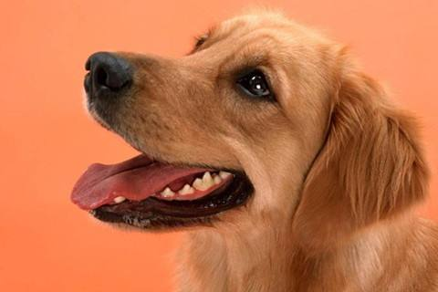

## paddle2tlx-vision

持续更新...

### 功能描述

利用 TensorLayerX 框架复现 PaddlePaddle 内置图像分类模型，对转换后模型做训练和预测验证

### 实现方式

手动替换算子

### 误差计算公式

L1 距离取绝对值

### 复现结果

测试输入：


**单样本 top5 预测类别**

```shell
# vgg16 - pd
kuvasz 0.8732064
Great Pyrenees 0.07099358
golden retriever 0.055797946
Labrador retriever 1.7175398e-06
Afghan hound, Afghan 3.4513076e-07

# vgg16 - tlx
kuvasz 0.8732064
Great Pyrenees 0.07099358
golden retriever 0.055797946
Labrador retriever 1.7175398e-06
Afghan hound, Afghan 3.4513076e-07
```

**推理预测误差**

| 模型 | 转换前后预测误差 |
| -- | -- |
| VGG16(pretrained model) | 0.0 |
| VGG19(pretrained model) | 0.0 |


**转换后训练模型**

参见文件 train_vision_tlx.py，可加载预训练模型做参数微调，也可从头开始训练


### 参考

- [TensorLayerX](https://github.com/tensorlayer/TensorLayerX)
- [PaddlePaddle](https://github.com/PaddlePaddle/Paddle)
